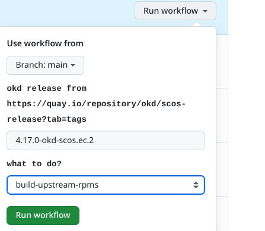
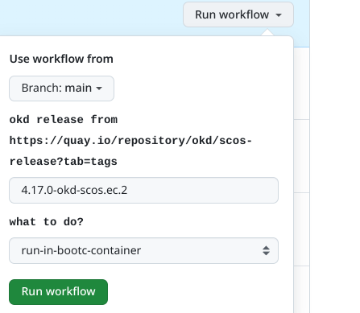

### Goals
- **Create a CI job that runs on demand to build and test Microshift upstream.**
  > This job should combine the Microshift sources with the specified OKD release  payload for testing.
  > 
- **Create a CI job that runs on demand to build and produce Microshift upstream RPMs.**
	This job should combine the latest Microshift sources with the specified OKD release  payload

### installing the example workflow
1. [create](https://docs.github.com/en/pull-requests/collaborating-with-pull-requests/working-with-forks/fork-a-repo#forking-a-repository) a fork from https://github.com/openshift/microshift 
2. Copy the gh-action  workflow example from `okd/gh-workflows/microshift-build-example.yml` to `.github/workflows/main.yaml` and push to the forked repository.

### Building upstream RPMs 
1. From within GH Actions UI select the workflow and click `Run Workflow`
2. Run the workflow with the following input options:
    - Released/Publish OKD version in [okd/scos-release](https://quay.io/repository/okd/scos-release?tab=tags): ie `4.17.0-okd-scos.ec.2` 
	- what to do:
		- Building upstream RPMs Only
		  >  
		- Building & Running Microshift in a bootc container , Making sure all the Microshift services are up and functional (using greenboot checks).
		  > 
3. RPM artifacts will be available for download after the job completes.
